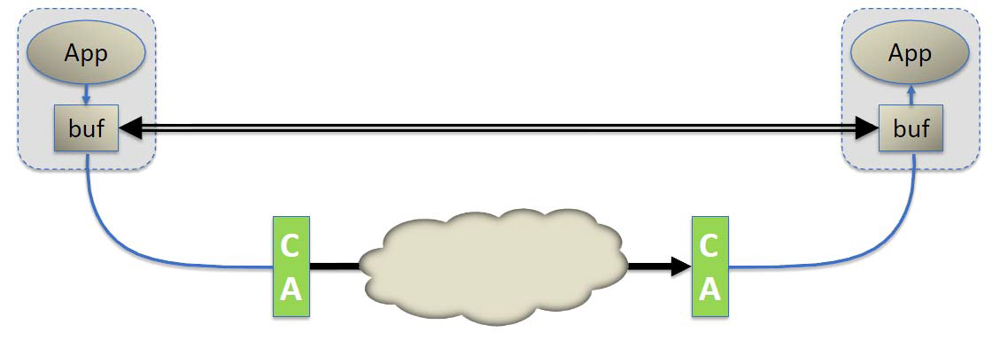
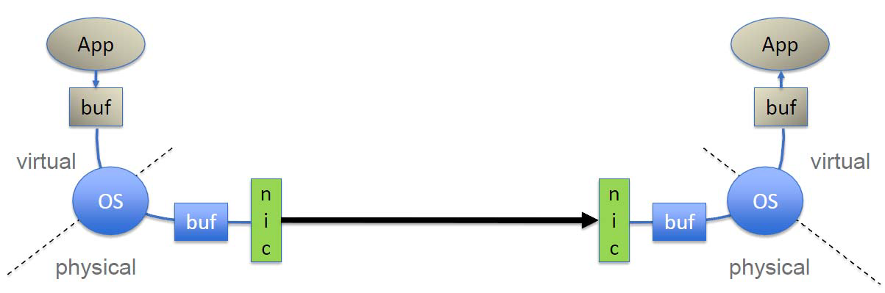

2 RDMA 架构概览
============================

2.1 InfiniBand
--------------

InfiniBand (IB) 是一种高速、低延迟、低 CPU 开销、高效且可扩展的服务器和存储互连技术。
InfiniBand 的关键功能之一是它支持本机远程直接内存访问 (RDMA)。InfiniBand 可在服务器
之间以及服务器与存储之间进行数据传输，而无需主机 CPU 参与数据路径。InfiniBand 使用 I/O
通道进行数据通信（每台主机最多 1600 万个），其中每个通道都提供虚拟化 NIC 或 HCA
（安全性、隔离等）的语义。InfiniBand 使用铜线和光纤连接，提供各种技术或解决方案速度，
范围从每端口 10Gb/s (SDR) 到 56Gb/s (FDR)。InfiniBand 的效率和可扩展性使其成为全球
领先的高性能计算、云、Web 2.0、存储、数据库和金融数据中心及应用程序的最佳性能和性价比
互连解决方案。 InfiniBand 是一项标准技术，由 IBTA 组织定义和指定。

2.2 Virtual Procotol Interconnect® (VPI)
----------------------------------------

Mellanox 虚拟协议互连 (VPI) 架构为支持 InfiniBand 和以太网语义的网络适配器和交换机之间
的通信提供了一种高性能、低延迟和可靠的方式。VPI 适配器或交换机可以设置为每个端口提供 InfiniBand
或以太网语义。例如，双端口 VPI 适配器可以配置为以下选项之一：

- 具有两个 InfiniBand 端口的适配器 (HCA)
- 具有两个以太网端口的 NIC
- 同时具有一个 InfiniBand 端口和一个以太网端口的适配器

类似地，VPI 交换机可以具有仅 InfiniBand 端口、仅以太网端口，或者同时工作 InfiniBand 和以太网端口。

基于 Mellanox 的 VPI 适配器和交换机同时支持 InfiniBand RDMA 和以太网 RoCE 解决方案。

2.3 RMDA over Converged Ethernet (RoCE)
---------------------------------------

RoCE 是以太网上的 RDMA 标准，也是由 IBTA 组织定义和指定的。RoCE 为以太网提供了真正的 RDMA 语义，
因为它不需要复杂且性能低下的 TCP 传输（例如，iWARP 需要）。

RoCE 是目前最高效的低延迟以太网解决方案。它需要的 CPU 开销非常低，并利用数据中心桥接以太网中的
优先级流量控制实现无损连接。自 OFED 1.5.1 发布以来，Open Fabrics 软件已完全支持 RoCE。

2.4 RMDA技术比较
----------------

目前，有三种技术支持 RDMA：InfiniBand、以太网 RoCE 和以太网 iWARP。这三种技术共享一个通用的用户
API（在本文档中定义），但具有不同的物理层和链路层。

在以太网解决方案方面，RoCE 的性能明显优于 iWARP ——无论是延迟、吞吐量还是 CPU 开销。许多领先的
解决方案都支持 RoCE，并且集成在 Windows Server 软件（以及 InfiniBand）中。

RDMA 技术基于传统网络中的网络概念，但它们与 IP 网络中的对应技术存在差异。主要区别在于 RDMA 提供
消息服务，应用程序可以使用该服务直接访问远程计算机上的虚拟内存。消息服务可用于进程间通信 (IPC)、
与远程服务器的通信以及使用上层协议 (ULP) 与存储设备通信，例如 iSCSI RDMA 扩展 (ISER) 和
SCSI RDMA 协议 (SRP)、存储消息块 (SMB)、Samba、Lustre、ZFS 等。

RDMA 通过堆栈旁路和复制避免提供低延迟，降低 CPU 利用率，减少内存带宽瓶颈并提供高带宽利用率。
RDMA 提供的关键优势来自 RDMA 消息服务呈现给应用程序的方式以及用于传输和传递这些消息的底层技术。
RDMA 提供基于通道的 IO。此通道允许使用 RDMA 设备的应用程序直接读取和写入远程虚拟内存。

在传统套接字网络中，应用程序通过 API 向操作系统请求网络资源，操作系统代表应用程序执行事务。
然而，RDMA 使用操作系统建立通道，然后允许应用程序直接交换消息，而无需操作系统进一步干预。
消息可以是 RDMA 读取、RDMA 写入操作或发送/接收操作。IB 和 RoCE 还支持多播传输。

IB 链路层提供多种功能，例如基于信用的流量控制机制，用于拥塞控制。它还允许使用虚拟通道 (VL)，
从而简化更高层级协议并提供高级服务质量。它保证在给定路径上 VL 内的强排序。IB 传输层提供可靠性
和交付保证。

IB 使用的网络层具有一些特性，即使应用程序物理上位于不同的服务器上，也可以简单地在应用程序的虚
拟内存之间直接传输消息。因此，最好将 IB 传输层与软件传输接口的组合视为 RDMA 消息传输服务。
整个堆栈（包括软件传输接口）构成了 IB 消息服务。

最重要的一点是，每个应用程序都可以直接访问结构中设备的虚拟内存。这意味着应用程序无需向操作系统
发出请求即可传输消息。这与传统网络环境形成鲜明对比，在传统网络环境中，共享网络资源归操作系统所
有，用户应用程序无法访问。因此，应用程序必须依靠操作系统的参与才能将数据从应用程序的虚拟缓冲区
空间移动到网络堆栈上。同样，在另一端，应用程序必须依靠操作系统代表其检索网络上的数据并将其放置
在其虚拟缓冲区空间中。

TCP/IP/以太网是一种面向字节流的传输方式，用于在套接字应用程序之间传递信息字节。TCP/IP 在设计上
是有损的，但使用传输控制协议 (TCP) 实现了可靠性方案。TCP/IP 要求操作系统 (OS) 干预每个操作，包
括线路两端的缓冲区复制。在面向字节流的网络中，消息边界的概念消失了。当应用程序想要发送数据包时，
操作系统会将字节放入属于操作系统的主内存中的匿名缓冲区中，当字节传输完成后，操作系统会将其缓冲区
中的数据复制到应用程序的接收缓冲区中。每次数据包到达时都会重复此过程，直到收到整个字节流。TCP 负
责重新传输由于拥塞而丢失的任何数据包。

在 IB 中，完整的消息直接传送给应用程序。一旦应用程序请求传输 RDMA 读取或写入，IB 硬件就会根据需
要将出站消息分段为数据包，数据包的大小由结构路径最大传输单元决定。这些数据包通过 IB 网络传输，并
直接传送到接收应用程序的虚拟缓冲区中，在那里它们被重新组装成完整的消息。一旦收到整个消息，就会通
知接收应用程序。因此，在整个消息传送到接收应用程序的缓冲区之前，发送应用程序和接收应用程序都无需
参与。

2.5 关键组件
------------

这些只是在部署 IB 和 RoCE 的优势背景下提出的。我们不讨论电缆和连接器。

**主机通道适配器 (Host Channel Adapter, HCA)**

HCA 提供 IB 端节点（例如，服务器）连接到 IB 网络的点。它们相当于以太网 (NIC) 卡，但它们的功能
更多。HCA 提供操作系统控制下的地址转换机制，允许应用程序直接访问 HCA。相同的地址转换机制是 HCA 
代表用户级应用程序访问内存的方式。应用程序引用虚拟地址，而 HCA 能够将这些地址转换为物理地址，以
影响实际的消息传输。

**范围扩展器 (Range Extenders)**

InfiniBand 范围扩展是通过将 InfiniBand 流量封装到 WAN 链路上并扩展足够的缓冲信用来确保整个 WAN 
的全带宽来实现的。

**子网管理器 (Subnet Manager)**

InfiniBand 子网管理器为连接到 InfiniBand 结构的每个端口分配本地标识符 (LID)，并根据分配的 LID 开
发路由表。IB 子网管理器是软件定义网络 (SDN) 的一个概念，它消除了互连的复杂性，并支持创建超大规模计
算和存储基础设施。

**交换机 (Switches)**

IB 交换机在概念上与标准网络交换机类似，但设计用于满足 IB 性能要求。它们实现 IB 链路层的流量控制，以
防止数据包丢失，并支持拥塞避免和自适应路由功能以及高级服务质量。许多交换机都包含子网管理器。配置 IB 
结构至少需要一个子网管理器。

2.6 支持现有应用程序和 ULP
---------------------------

IP 应用程序可使用 IP over IB (IPoIB) 或 Ethernet over IB (EoIB) 或 RDS ULP 在 InfiniBand 结构
上运行。存储应用程序通过 iSER、SRP、RDS、NFS、ZFS、SMB 等获得支持。MPI 和 Network Direct 也都是受
支持的 ULP，但不在本文档的讨论范围内。

2.7 参考
----------

- IBTA Intro to IB for End Users
  http://members.infinibandta.org/kwspub/Intro_to_IB_for_End_Users.pdf
- Mellanox InfiniBandFAQ_FQ_100.pdf
  http://www.mellanox.com/pdf/whitepapers/InfiniBandFAQ_FQ_100.pdf
- Mellanox WP_2007_IB_Software_and_Protocols.pdf
  http://www.mellanox.com/pdf/whitepapers/WP_2007_IB_Software_and_Protocols.pdf
- Mellanox driver software stacks and firmware are available for download from Mellanox Technologies\'
  Web pages: http://www.mellanox.com